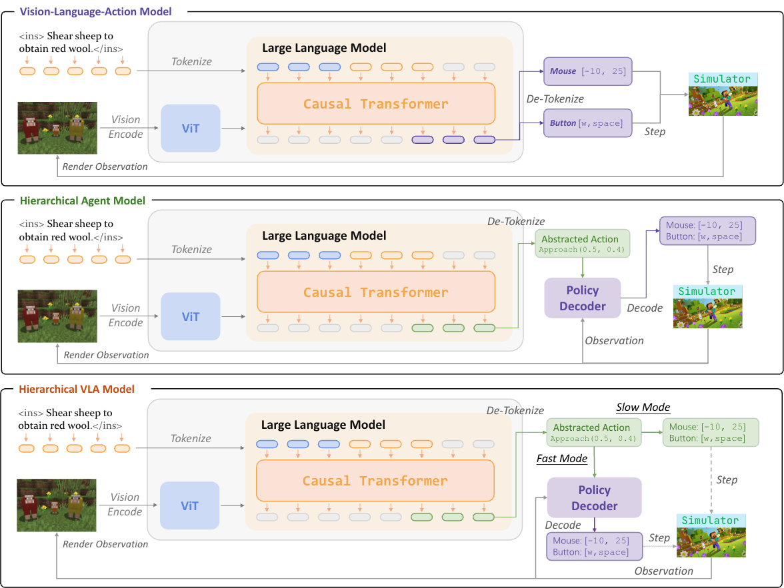

# <center> OpenHA: A Series of Open-Source Hierarchical Agentic Models in Minecraft</center>

<div align="center">
    <a href="https://craftjarvis.github.io/"></a>
    <a href="https://huggingface.co/CraftJarvis"></a>
    <a href="https://github.com/CraftJarvis/OpenHA/blob/master/LICENSE"></a>
</div>

<div align="center">	
    <a href="https://arxiv.org/abs/2509.13347"></a>
    <a href="https://huggingface.co/collections/CraftJarvis/openha-68c5248493fc6672b3ccaa29"></a>
    <a href="https://huggingface.co/collections/CraftJarvis/openha-68c5248493fc6672b3ccaa29"></a>
    <a href="https://github.com/CraftJarvis/OpenHA"></a>
    <a href="https://github.com/CraftJarvis/OpenHA"></a>
</div>



---

## ⭐️ Updates
- **[2025.12] Released our paper: "[Training One Model to Master Cross-Level Agentic Actions via Reinforcement Learning](https://arxiv.org/abs/2512.09706)".**
- **[2025.09] Released our paper: "[OpenHA: A Series of Open-Source Hierarchical Agentic Models in Minecraft](https://arxiv.org/abs/2509.13347)".**
- **[2025.09] Released the codebase.**

---

## 🎈 Getting Started

### 🔧 Installation
Clone repo and install dependencies:

```sh
git clone --recurse-submodules https://github.com/CraftJarvis/OpenHA.git
conda create -n openha python=3.10
conda activate openha
pip install torch==2.6.0 torchvision==0.21.0 torchaudio==2.6.0 --index-url https://download.pytorch.org/whl/cu124  # check your CUDA version
cd OpenHA
conda install --channel=conda-forge openjdk=8 -y
pip install -e .
```

> ⚠️ Note: The script will install **minestudio** automatically. If you have not used MineStudio before, please check [the tutorial](https://craftjarvis.github.io/MineStudio/overview/getting-started.html).

For grounding-HA integration with [ROCKET-1](), you need a slightly modified **SAM2**:
```sh
cd external/SAM2
pip install -e .
```

---

### 🚀 Inference
OpenHA supports multiple ways to serve and load models.  
We recommend **vLLM** for efficient multi-GPU / multi-process rollout. Example:

```sh
CUDA_VISIBLE_DEVICES=0,1,2,3 vllm serve CraftJarvis/minecraft-openha-qwen2vl-7b-2509  \
    --served-model-name minecraft-openha-qwen2vl-7b-2509  \
    --port 11000 \
    --limit-mm-per-prompt image=25  \
    --trust-remote-code --gpu-memory-utilization 0.90  \
    --pipeline-parallel-size 1  \
    --tensor-parallel-size 4  \
    --max-num-seqs 16 \
    --max-logprobs 20 \
    --max-model-len 32768
```

Once the model is loaded, run rollout:

```sh
python examples/rollout_openha.py --output_mode text_action  \
    --vlm_client_mode online \
    --system_message_tag text_action \
    --model_ips localhost --model_ports 11000 \
    --model_id minecraft-openha-qwen2vl-7b-2509 \
    --record_path "/DATA/limuyao/evaluate" \
    --max_steps_num 200 \
    --num_rollouts 8
```

OpenHA also supports HuggingFace Transformers (`hf`) or offline `vllm` loading.  
Just change the `--vlm_client_mode` argument accordingly.

---

## 🎮 Interaction Details

You can control the **output format** of OpenHA via `system_message_tag` in `rollout_openha.py`.

| Parameter          | Output Example                                                                                                       | System Prompt                                                                 |
|--------------------|-----------------------------------------------------------------------------------------------------------------------|--------------------------------------------------------------------------------|
| `text_action`      | `Action: move(dx='4.0', dy='-1.0') and keyDown(keys=(keyboard.left.control, keyboard.w))`                            | [text_action.txt](./openagents/assets/system_prompt/text_action.txt)                      |
| `grounding_action` | `Grounding: move_camera <\|object_ref_start\|>empty slot<\|object_ref_end\|><\|point_start\|>(881,558)<\|point_end\|>` | [grounding.txt](./openagents/assets/system_prompt/grounding.txt)                          |
| `motion_action`    | `Motion: cursor move left and down`                                                                                  | [motion.txt](./openagents/assets/system_prompt/motion.txt)                                |
| `grounding_coa`    | `Grounding: ... (615,505)... \n, Action: move(19, 0) and press()`                                                    | [grounding_coa.txt](./openagents/assets/system_prompt/grounding_coa.txt)                  |
| `motion_coa`       | `Motion: cursor move right and up \n, Action: move(17, 0) and press()`                                               | [motion_coa.txt](./openagents/assets/system_prompt/motion_coa.txt)                        |

Corresponding `output_mode` values:  

```python
MODE_SYSTEM_PROMPT_MAP = {
    "greedy": {"motion_coa", "grounding_coa"},
    "text_action": {"text_action"},
    "grounding": {"grounding_action"},
    "motion": {"motion_action"},
}
```

---

## 📦 Models on 🤗 Hugging Face

| Model Name                           | Size | HuggingFace URL                                                                                     | Training Framework                                   |
|--------------------------------------|------|-----------------------------------------------------------------------------------------------------|------------------------------------------------------|
| Minecraft-MotionHA-Qwen2VL-2509      | 7B   | https://huggingface.co/CraftJarvis/minecraft-motionha-qwen2vl-7b-2509                               | [TRL](https://github.com/huggingface/trl)            |
| Minecraft-PointHA-Qwen2VL-2509       | 7B   | https://huggingface.co/CraftJarvis/minecraft-pointha-qwen2vl-7b-2509                                | [TRL](https://github.com/huggingface/trl)            |
| Minecraft-TextVLA-Qwen2VL-2509       | 7B   | https://huggingface.co/CraftJarvis/minecraft-textvla-qwen2vl-7b-2509                                | [VeOmni](https://github.com/ByteDance-Seed/VeOmni)   |
| Minecraft-OpenHA-Qwen2VL-2509-Base   | 7B   | https://huggingface.co/CraftJarvis/minecraft-openha-qwen2vl-7b-2509                                 | [VeOmni](https://github.com/ByteDance-Seed/VeOmni)   |

---

## 📊 Datasets on 🤗 Hugging Face

| Action Space     | Size        | HuggingFace URL                                                                 |
|------------------|-------------|---------------------------------------------------------------------------------|
| Motion Action    | 1B Tokens   | https://huggingface.co/datasets/CraftJarvis/minecraft-motion-action-dataset                 |
| Grounding Action | 0.5B Tokens   | https://huggingface.co/datasets/CraftJarvis/minecraft-grounding-action-dataset              |
| Text Action      | 2B Tokens   | https://huggingface.co/datasets/CraftJarvis/minecraft-text-action-dataset                   |
| Motion CoA       | 0.5B Tokens | https://huggingface.co/datasets/CraftJarvis/minecraft-motion-coa-dataset                    |
| Grounding CoA    | 0.2B Tokens | https://huggingface.co/datasets/CraftJarvis/minecraft-grounding-coa-dataset                 |

---


## 😊 Acknowledgement
We thank the following projects for their excellent work:  
- [minerl](https://github.com/minerllabs/minerl)  
- [malmo](https://github.com/microsoft/malmo)  
- [MineStudio](https://github.com/CraftJarvis/MineStudio/tree/master)  
- [ROCKET-1](https://github.com/CraftJarvis/ROCKET-1)  
- [SAM2](https://github.com/facebookresearch/sam2)  


---

## 📝 Citation
If you find **OpenHA** useful, please give us a ⭐ on GitHub or cite us:

```bibtex
@article{wang2025openha,
      title={OpenHA: A Series of Open-Source Hierarchical Agentic Models in Minecraft}, 
      author={Zihao Wang and Muyao Li and Kaichen He and Xiangyu Wang and Zhancun Mu and Anji Liu and Yitao Liang},
      journal = {arXiv preprint arXiv:2509.13347},
      year={2025},
      url={https://arxiv.org/abs/2509.13347}, 
}
```
